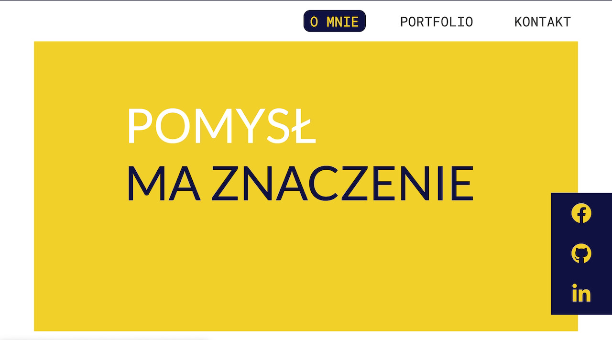
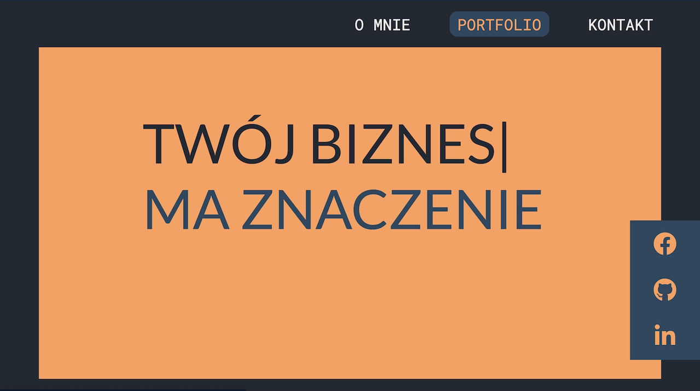

# CodersCamp 2020 - Projekt HTML & CSS

## Projekt HTML & CSS — Wizytówka / Portfolio
Celem projektu jest prezentacja umiejętności w pisaniu kodu html oraz CSS po pierwszym module __CodersCamp2020__

### W projekcie wykorzystałem:
- Box-model
- Kaskadowość CSS
- Selektory CSS
- Popularne tagi HTML
- Zmienne
- Zapisywanie kolorów
- Stylowanie tekstu
- Zewnętrzne ikony - fontawesome
- Zwenętrzne fonty (google fonts)
- Flexbox
- CSS Grid
- Position (absolute, relative)
- Animacje keyframes
- Formularz
- Dynamiczne wykrywanie trybu jasnego/ciemnego
- Płynne przewijanie strony bez użycia JS
- Wizytówka została przygotowana zgodnie z zasadami Responsive Web Design

### Repozytorium
W repozytorium znajdują się:
* plik _index.html_
* folder _style_ zawierający plik _style.css_
* folder _img_ zawierający zdjęcia wyświetlane na dużych rozdzielczościach oraz podfolder _mobile_ zawierający zdjęcia wyświetlane na urządzeniach mobilnych. __Przełącznie pomiędzy zdjęciami odbywa się w ramach *Media Querries*__
Zdjęcia w formacie _.jpg_ pobrane ze strony _https://pixabay.com/pl/_

### Podgląd trybu jasnego oraz ciemnego

